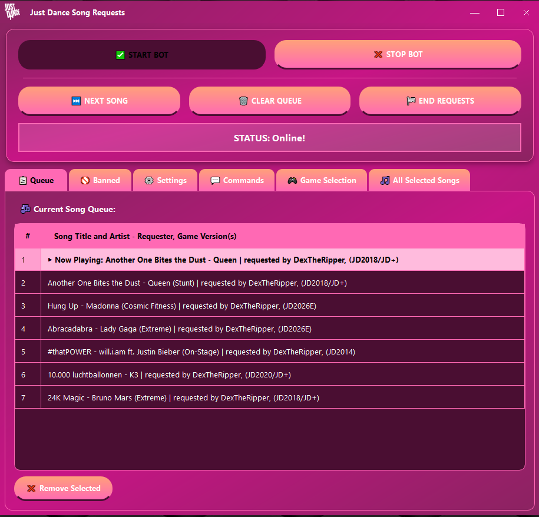
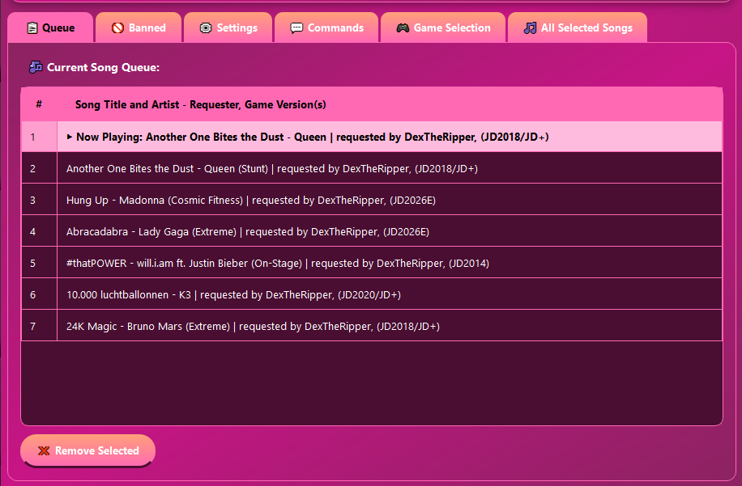
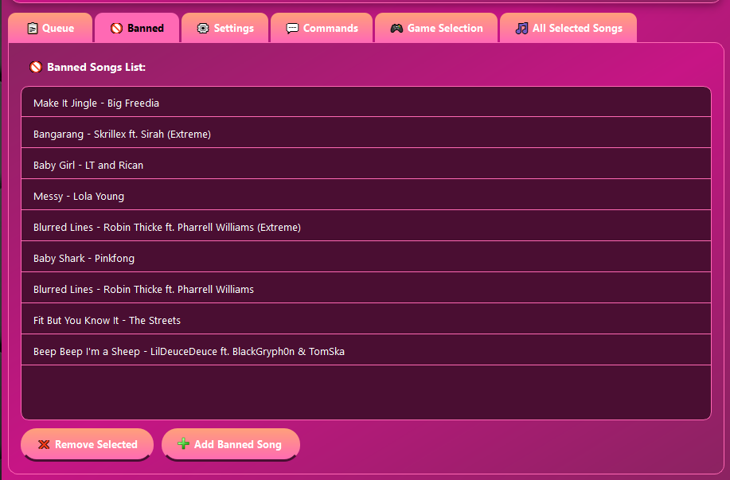
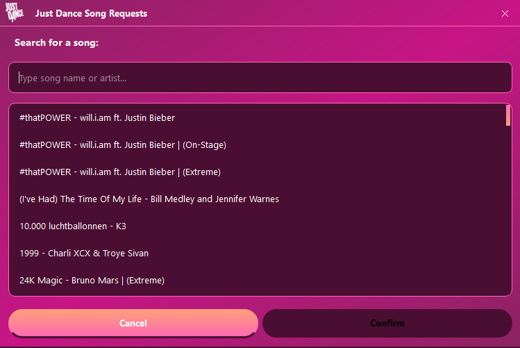
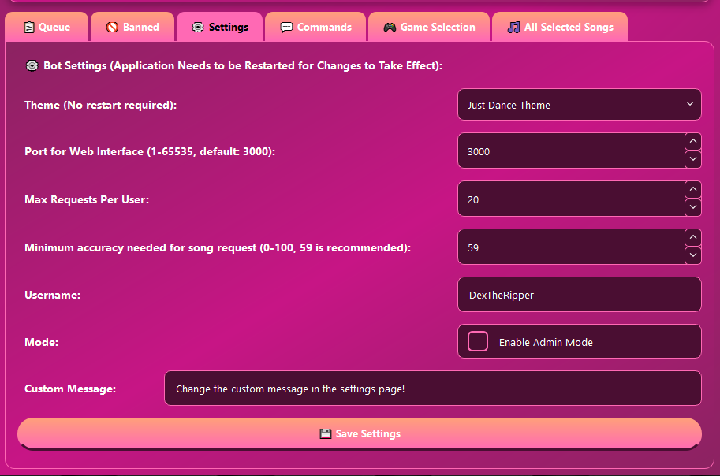
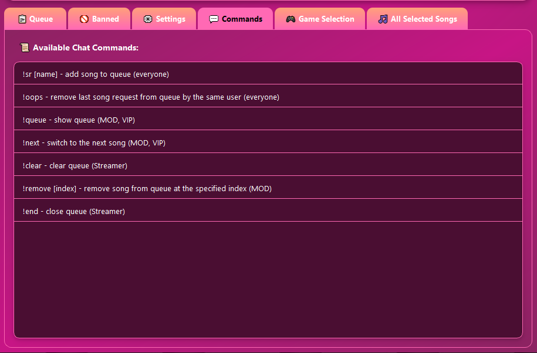
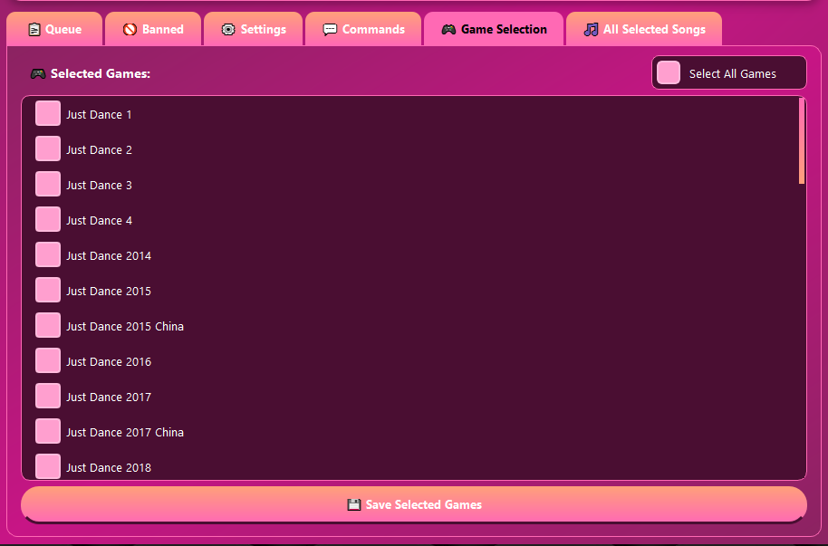
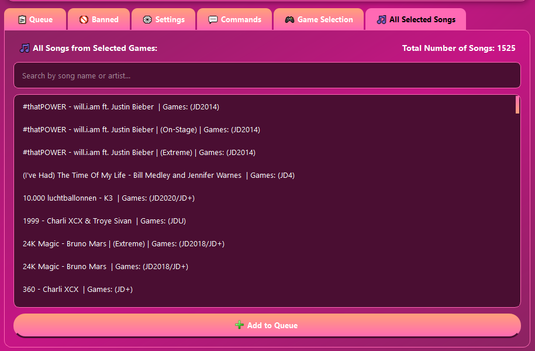
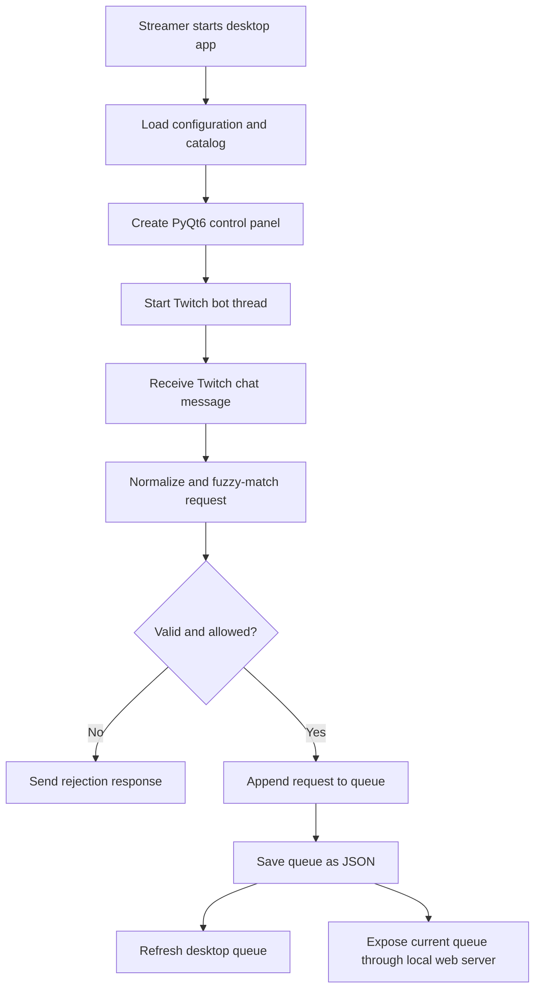

# Just Dance Song Requests Bot

A desktop Twitch companion application for managing Just Dance song requests during a livestream. Viewers submit songs through Twitch chat, the application finds the closest matching song in the local catalog, and the streamer manages the queue through a PyQt6 control panel.



> **Portfolio note:** The image above is a placeholder. Add a screenshot at `docs/images/application-overview.png` before publishing the repository.

## What It Does

The application combines three parts:

- A PyQt6 desktop interface for the streamer.
- An asynchronous Twitch chat bot for receiving and responding to commands.
- A small local web page that exposes the current queue for an overlay or second screen.

The bot accepts natural-language song requests rather than requiring an exact catalog title. It normalizes the request, compares it with song titles and artist/title combinations using RapidFuzz, detects alternate versions and Extreme versions, and adds an accepted match to the queue.

The streamer can then inspect, reorder by removing, clear, or advance the queue from the desktop application. Queue data is saved as JSON so it can survive application restarts.

## Features

- Twitch chat integration using `twitchAPI`.
- Fuzzy song matching with RapidFuzz.
- Matching against song title, title plus artist, and artist plus title.
- Detection of alternate choreography/version keywords.
- Separate handling for Extreme versions.
- Per-user request limits.
- Optional moderator-only request mode.
- Duplicate-song protection.
- Banned-song management.
- Game-version filtering, including JD+ entries.
- Persistent JSON queue storage.
- Persistent application settings.
- Theme-aware PyQt6 interface.
- Local queue web endpoint at `/data`.
- Optional encrypted song catalog loaded with Fernet.

## Screenshots

### Queue Tab

Displays the current request order, requester, game version, and the song currently being played. The streamer can remove a selected request from the queue.



### Banned Tab

Displays songs that should not be accepted during the stream. The streamer can search the catalog, add a song to the banned list, or remove a selected banned song.



Clicking on "Add Banned Song" opens a popup where the user searches for and selects the song to be added to the banned list.



### Settings Tab

Controls the application theme, local web-server port, maximum requests per viewer, matching accuracy threshold, Twitch username, moderator-only mode, and the custom response used when requests are restricted.



### Commands Tab

Shows the commands currently available to viewers and moderators. The command descriptions are loaded from the configured commands file rather than being embedded in the UI.



### Game Selection Tab

Allows the streamer to choose which Just Dance games are included in matching. Selecting or clearing games immediately changes the catalog used by the search and song list views.



### All Selected Songs Tab

Provides a searchable view of every song in the currently selected catalog. The streamer can search by song or artist and add a selected result directly to the queue.



## Twitch Chat Commands

The default command set is:

| Command | Permission | Description |
| --- | --- | --- |
| `!sr [name]` | Everyone, unless admin mode is enabled | Find and add a song request. |
| `!oops` | Everyone | Remove the requesting viewer's most recent request. |
| `!queue` | Moderator, VIP, or streamer | Show the current queue in chat. |
| `!next` | Moderator, VIP, or streamer | Mark the first request as played. |
| `!clear` | Streamer | Remove every request from the queue. |
| `!remove [index]` | Moderator or streamer | Remove a request by queue position. |
| `!end` | Streamer | Stop accepting requests for the rest of the stream. |

The command list shown in the application is loaded from `resources/commands.txt` in the current configuration. The exact permissions are enforced in `bot.py`.

## How It Works

### Startup

1. `main.py` loads `resources/config.cfg`.
2. The application loads Twitch credentials and the Fernet key from the excluded auth directory.
3. The encrypted song catalog is decrypted in memory and loaded into a pandas DataFrame.
4. The selected-game filter is applied.
5. Banned songs, commands, and saved settings are loaded.
6. The PyQt6 window is created.

The Twitch bot is not started until the user presses **Start Bot**.

### Request Matching

When a viewer sends `!sr`:

1. The bot checks whether admin mode, stream-ending mode, or the per-user request limit blocks the request.
2. The request is checked for an Extreme keyword.
3. The query is normalized.
4. RapidFuzz compares it with normalized song titles and title/artist combinations.
5. The matcher checks for alternate-version keywords such as choreography or fitness variants.
6. A possible Extreme match is compared with the regular match.
7. The best result is checked against the configured similarity threshold.
8. The bot rejects duplicates and banned songs.
9. An accepted request is added to the queue and saved to JSON.
10. Twitch receives a response describing the result.

### Desktop and Bot Coordination

The desktop application runs the Twitch event loop in a background thread. PyQt signals are used to report connection status back to the GUI, while a timer refreshes the visible queue. The local web server receives a reference to the queue and exposes a small JSON response for display elsewhere.



## Project Structure

```text
.
├── main.py                  # PyQt6 application and streamer controls
├── bot.py                   # Twitch events, commands, and queue persistence
├── queryMatching.py         # Fuzzy matching and version detection
├── specialVersionMatching.py# Alternate-version matching
├── normalization.py         # Search normalization helpers
├── queue_utils.py           # Queue formatting and duplicate checks
├── ui_widgets.py            # Custom PyQt6 list/tree widgets
├── server.py                # Local queue web server
├── colors.py                # Application themes
├── SearchDialog.py          # Song search dialog
├── csvProcessing.ipynb      # Catalog preparation and encryption workflow
├── requirements.txt         # Python dependencies
├── resources/
│   ├── config.cfg           # Runtime paths and user settings
│   ├── commands.txt         # Chat commands shown in the UI
│   ├── songLists/            # Private catalog and local runtime data
│   └── auth/                # Local credentials and encryption key, ignored
└── style/main.qss           # Qt stylesheet
```

## Setup

### Requirements

- Windows, macOS, or Linux
- Python 3.10 or newer
- A Twitch account for the bot
- A Twitch application registered in the Twitch developer console
- The private song catalog and encryption key supplied separately

### Installation

```bash
git clone <your-repository-url>
cd JDSongRequests-Bot
python -m venv .venv
```

Windows PowerShell:

```powershell
.\.venv\Scripts\Activate.ps1
python -m pip install -r requirements.txt
```

macOS/Linux:

```bash
source .venv/bin/activate
python -m pip install -r requirements.txt
```

### Private Runtime Files

The public repository intentionally does not contain credentials or the song catalog. Create the following files locally using values supplied outside Git:

```text
resources/auth/twitch_credentials.json
resources/auth/fernet_key.json
resources/songLists/data.csv.enc
```

Example credential-file shapes:

```json
{
  "APP_ID": "your-twitch-application-id",
  "APP_SECRET": "your-twitch-application-secret"
}
```

```json
{
  "key": "your-fernet-key"
}
```

Do not commit real values. OAuth tokens are created and stored locally after the first successful authentication. The Twitch app secret and OAuth token should be revoked if they are ever exposed.

### Running

```bash
python main.py
```

Press **Start Bot** in the application to connect to Twitch. The local queue page becomes available at the configured port (for use in OBS), for example:

```text
http://127.0.0.1:3000
```

## Configuration

The runtime configuration is stored in `resources/config.cfg`.

Important settings include:

- `max_requests_per_user`: maximum requests allowed per viewer.
- `query_accuracy`: minimum fuzzy-match score required for acceptance.
- `port`: local queue web-server port.
- `admin_mode`: restrict requests to moderators and the streamer.
- `custom_message`: response shown when a request is blocked by admin mode.
- `song_queue_file_path`: JSON file used for queue persistence.
- `alternate_file_path`: JSON list of alternate-version keywords.
- `commands_file_path`: text file containing the displayed chat commands.

## Security and Privacy

This project is designed to keep private runtime material outside the public repository:

- Twitch credentials are stored under the ignored `resources/auth/` directory.
- The OAuth token file is local runtime state.
- The song catalog is kept outside the public repository and loaded in encrypted form from `resources/songLists/`.
- The local web server binds to `127.0.0.1` and is intended for the local machine.

## Development Notes

This application is a work in progress. It does not reflect how the end product will be executed as the main goal is to have a website for broader use.

For this demonstration preview, the file with the list of songs is not included for security reasons, as well as the authentication files or the encrypted version of such file. 

The matching pipeline can be developed independently of Twitch by passing a prepared pandas DataFrame to `find_best_match()`. Queue formatting and duplicate checks are also separated into `queue_utils.py`, which makes them suitable for focused tests.

The catalog preparation notebook demonstrates how the source catalog is cleaned, normalized, encrypted, and used to generate `alternates.json`.

## License

This is a private project. The source code is provided for review and evaluation only.

No permission is granted to copy, modify, distribute, publish, sublicense, or use this project or any portion of it without prior written permission from the author.